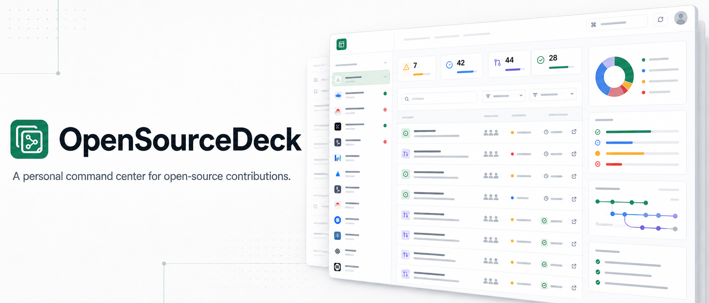
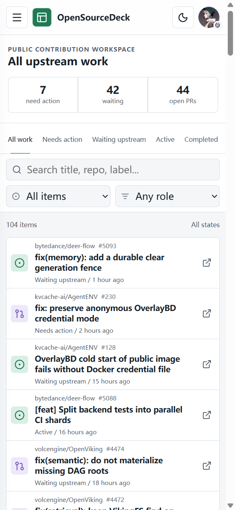

<p align="center">
  
</p>

<p align="center">
  <a href="README.md">简体中文</a> &middot; English
</p>

<p align="center">
  <a href="https://onefly.top/opensource-deck/"></a>
  <a href="https://github.com/ranxi2001/opensource-deck/actions/workflows/ci.yml"></a>
  <a href="LICENSE"></a>
  
  
</p>

<p align="center">
  Turn GitHub issues, pull requests, reviews, and CI results into one navigable,
  action-oriented workspace.
</p>

<p align="center">
  <a href="https://onefly.top/opensource-deck/">Live dashboard</a> &middot;
  <a href="#quick-start-with-github-pages">Quick start</a> &middot;
  <a href="docs/ARCHITECTURE.md">Architecture</a> &middot;
  <a href="docs/DEPLOYMENT.md">Deployment</a> &middot;
  <a href="CHANGELOG.md">Changelog</a> &middot;
  <a href="CONTRIBUTING.md">Contributing</a>
</p>

> [!NOTE]
> **v0.1 public mode is live.** Private access requires a separately configured
> OAuth relay and is not enabled on the public deployment.

## Quick Start With GitHub Pages

The recommended setup is to fork this repository and let the included GitHub
Actions workflow build your personal dashboard. The workflow automatically
uses the fork owner as the default GitHub user and derives the Pages path from
the repository name. **No project files need to change**, so the fork can keep
syncing cleanly with upstream.

1. [Fork this repository](https://github.com/ranxi2001/opensource-deck/fork).
2. In the fork, enable workflows from the **Actions** tab if GitHub asks you to
   do so.
3. Open **Settings → Pages**, then set **Source** to **GitHub Actions**.
4. Return to **Actions**, select **Sync and deploy Pages**, and choose
   **Run workflow** for the first deployment.
5. When it finishes, open `https://<your-user>.github.io/<repository-name>/`.
   If the repository is named `<your-user>.github.io`, open
   `https://<your-user>.github.io/` instead.

The workflow refreshes public data every hour. Generated account data stays in
the Pages artifact and is not committed to your repository. Personal-account
forks need no extra configuration. For an organization-owned fork, set the
`OSDECK_GITHUB_USER` Actions variable to the personal GitHub username to show;
this also leaves project files unchanged. See [the deployment guide](docs/DEPLOYMENT.md)
for custom domains and the optional private-repository relay.

## Dashboard

[](https://onefly.top/opensource-deck/)

<details>
<summary>View the mobile workspace</summary>
<br />
<p align="center">
  
</p>
</details>

## Highlights

- Discovers contribution work from GitHub account activity instead of a manual
  repository list.
- Uses Chinese as the default interface language.
- Finds open issues updated in the last 30 days across recently active projects,
  with repository, keyword, assignment, and contribution-label filters.
- Groups work by full `owner/name` repository identity.
- Separates Needs action, Waiting upstream, Active, Completed, and Snoozed work.
- Explains every state with deterministic source facts and reason codes.
- Surfaces failing and pending CI, requested reviews, requested changes, merge
  conflicts, labels, roles, and recent activity.
- Provides responsive project navigation, filters, details, quick links,
  themes, and keyboard command search.
- Provides the read-only `osdeck` CLI and a repository-distributed Agent Skill
  for terminal triage and structured automation.

## Access Modes

### Public Username

Enter any GitHub username in the account panel. The browser performs a limited,
anonymous, read-only lookup of recent public activity. The live view is capped
at 20 recently active repositories. Within anonymous API limits, it enriches
the 5 most recently updated open pull requests where the user is an author or
reviewer with current-head CI, reviews, comments, and merge state. Other items
are explicitly marked incomplete instead of treating unknown data as success or
Waiting upstream.

Recent-issue discovery scans the first 8 of those repositories. Authenticated
collection scans up to 20 repositories. Candidates use only public signals such
as assignees, open linked pull requests, `good first issue`, and `help wanted`.
Unassigned means only that GitHub reports no Assignee; the UI also shows open
PR activity when the bounded relationship check finds it. Check the discussion,
overlapping PRs, and contribution policy before starting work.

The deployed snapshot for the repository owner is generated hourly by GitHub
Actions with the repository-scoped `GITHUB_TOKEN`. It contains public data only.
The header refresh button preserves the full snapshot and candidate issues,
then refreshes the current head, CI, reviews, comments, and merge state for up
to 10 recent open pull requests where the user is an author or reviewer, plus
new comments for 5 recently active open Issues where the user participated. A
new commit or Issue reply can therefore be tracked without waiting for the next
Pages sync. Items outside the bounded refresh keep the last snapshot data;
manually running **Sync and deploy Pages** performs a full sync.

### GitHub Login And Private Repositories

The optional relay under `worker/` implements GitHub OAuth with PKCE, server-side
code exchange, exact origin checks, and an AES-GCM encrypted HttpOnly session
cookie. The GitHub token is never returned to the frontend or written to the
Pages artifact.

Private mode requires a GitHub OAuth App and a deployed relay. See
[docs/DEPLOYMENT.md](docs/DEPLOYMENT.md). Same-site custom domains are
recommended because browsers can block cross-site session cookies.

## CLI

The source-distributed CLI requires Node.js 24 or newer. It has not been
published to npm. Build and link it from a clone:

```bash
npm ci
npm link
osdeck summary
```

During development, run the same commands without linking:

```bash
npm run cli -- summary
npm run cli -- work --state needs_action
npm run cli -- issues --signal contribution_label
```

The CLI reads `--source`, then `OSDECK_SOURCE`, then its local public cache, and
finally the canonical deployed snapshot. All inspection commands support
`--json` for agents:

```bash
osdeck summary --json
osdeck work --project owner/repo --json
osdeck issues --signal unassigned --limit 100 --json
osdeck show 'owner/repo#123' --json
osdeck url 'owner/repo#123'
```

Refresh the public cache with `osdeck sync --user <login>`. An optional
`GITHUB_TOKEN` or `GH_TOKEN` improves public rate limits and enrichment, but
the CLI always excludes private repositories and never writes the token. Use
the OAuth browser view for private repositories.

## Agent Skill

The companion Skill lives at `skills/opensource-deck/`. It teaches compatible
agents to use structured CLI output, check freshness and truncation, interpret
queue reasons conservatively, and verify live GitHub ownership before starting
a contribution.

For a local Codex installation, expose the repository-owned Skill without
copying it:

```bash
mkdir -p "${CODEX_HOME:-$HOME/.codex}/skills"
ln -s "$PWD/skills/opensource-deck" \
  "${CODEX_HOME:-$HOME/.codex}/skills/opensource-deck"
```

Then invoke it as `$opensource-deck`. Installing or publishing the Skill is an
explicit user action; the repository does not modify global agent settings.

## Local Development

Requirements: Node.js 24 or newer.

```bash
npm ci
npm run dev
```

The default development view uses committed public sample data. To collect a
current public snapshot without committing it:

```bash
GITHUB_TOKEN="$(gh auth token)" npm run sync -- --output public/data/live.json
VITE_DATA_FILE=data/live.json npm run dev
```

Do not use a token with private repository access for a static Pages snapshot.

## Validation

```bash
npm run check
npx playwright install --with-deps chromium
npm run test:e2e
```

`npm run check` covers formatting, lint, TypeScript, unit/component/security
tests, production build, and a Cloudflare Worker dry-run. Playwright covers
desktop and mobile interactions, Axe accessibility checks, and horizontal
overflow.

## Repository Map

| Path                     | Purpose                                                     |
| ------------------------ | ----------------------------------------------------------- |
| `src/domain/`            | Versioned schemas, classification, aggregation, and filters |
| `scripts/`               | GitHub collection and atomic snapshot generation            |
| `cli/`                   | Read-only human and structured Agent command interface      |
| `skills/opensource-deck` | Repository-distributed Agent workflow                       |
| `src/components/`        | Operational dashboard and account access interface          |
| `worker/`                | Optional OAuth relay for private repository mode            |
| `e2e/`                   | Playwright and reusable CDP browser validation              |
| `.github/workflows/`     | CI plus public snapshot and Pages deployment                |
| `docs/PRD.md`            | Product requirements and acceptance contract                |
| `docs/ARCHITECTURE.md`   | Runtime, data, auth, and trust boundaries                   |
| `docs/DEPLOYMENT.md`     | Pages and optional OAuth relay setup                        |

## Product Principles

- Read-only: OpenSourceDeck never mutates upstream GitHub state.
- Explainable: deterministic reason codes, not opaque scores.
- Public artifact: private repository data never enters static build output.
- Secure sessions: private tokens stay inside the relay's encrypted HttpOnly
  cookie.
- Dashboard first: the application opens on the working view, not a marketing
  page.

## Prior Art

OpenSourceDeck is informed by
[PersonalDashboard](https://github.com/roshkhatri/PersonalDashboard),
[gh-dash](https://github.com/dlvhdr/gh-dash), and
[Octobox](https://github.com/octobox/octobox). It is an independent
implementation and does not include their source code.

## Contributing And Security

Read [CONTRIBUTING.md](CONTRIBUTING.md) before proposing a change. Do not open a
public issue for a vulnerability or private-data exposure; follow
[SECURITY.md](SECURITY.md).

## License

[MIT](LICENSE)
