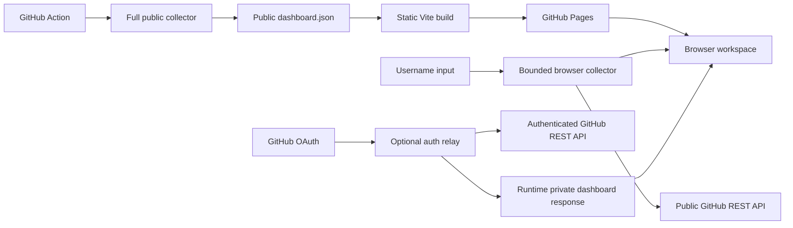

# OpenSourceDeck Architecture

## System Shape

OpenSourceDeck has one frontend and two data paths:

The static artifact never contains private repository data. Private data exists
only in an authenticated response and browser memory.

## Domain Layer

`src/domain/schema.ts` owns runtime-validated contracts for configuration,
projects, work items, generated dashboard data, states, roles, checks, and
reason codes. It also validates recent issue candidates and their public
assignment or contribution-label signals. The schema version is independent
from the package version.

`classifier.ts` is pure and deterministic. Terminal state wins first. Manual
overrides can choose Snoozed, Active, or Waiting upstream without suppressing
source facts. Confirmed action signals then win, followed by visible activity
order and a conservative Active or Unknown fallback.

Waiting upstream means only that the configured user produced the last visible
relevant activity. It does not claim a maintainer accepted ownership.

`aggregate.ts` merges discovery roles by stable node identity and groups work
by full `owner/name`. Repository base names are never identity keys.

## GitHub Collection

The collector uses GET-only Search and REST requests behind `GitHubClient`.
Role-specific searches preserve whether the user authored, was assigned,
reviewed, was requested, or was involved. Repository metadata is loaded before
items are retained, so static/public mode drops non-public repositories even if
the supplied local token can see them.

Full collection enriches open work with comments, pull request state, reviews,
check runs, mergeability, and public fork links. Requests use bounded
concurrency and explicit pagination. Optional enrichment failures become
warnings and never turn missing CI into success.

Browser public lookup is intentionally limited to 20 recently active
repositories and skips per-item enrichment to stay within anonymous limits. It
scans the first 8 repositories for open issues updated within 30 days; full
collection scans at most 20. Issues already present in the contribution
workspace are excluded from the candidate list.

The sync command writes a temporary file and atomically renames it to the output
path. Live local output is ignored by Git.

## Frontend

The React/Vite application parses every input artifact with Zod before render.
GitHub text is rendered as text, not raw HTML. The interface uses a stable
desktop grid and responsive mobile list, actual repository avatars, project and
queue navigation, composite filters, detail views, command search, theme
selection, and safe external links. Simplified Chinese is the default UI. A
separate recent-issue view filters public assignment and contribution-label
signals without interpreting them as ownership or acceptance.

The frontend has no GitHub write operation. Reload means re-fetching the active
data source, not rerunning CI or mutating notifications.

## Private Authentication

GitHub supports PKCE, but browser token exchange still requires a confidential
boundary and is not reliably available through CORS. `worker/src/index.ts`
implements a minimal relay:

1. Validate `return_to` against an exact origin allowlist.
2. Generate OAuth state, PKCE verifier, and challenge.
3. Encrypt state, verifier, return URL, and expiry into an HttpOnly cookie.
4. Exchange the callback code server-side using the OAuth client secret.
5. Verify the user through `GET /user`.
6. Encrypt the access token, login, and expiry into an HttpOnly session cookie.
7. Run the same collector with authenticated access and private visibility
   enabled.

The relay has no database and returns no token to JavaScript. CORS reflects
only an exact allowed origin, credentials are required, responses use
`no-store`, and logout is POST-only.

Private mode should use same-site custom domains for the Pages frontend and
relay. A `github.io` frontend and `workers.dev` relay are cross-site, and modern
browsers may block the session cookie.

## Deployment And CI

CI runs formatting, ESLint, TypeScript, Vitest, production build, Worker
dry-run, and Playwright desktop/mobile Axe checks. The Pages workflow performs
full public collection, runs all static checks, builds at `/opensource-deck/`,
scans `dist/` for credential-like content, and uploads a Pages artifact. It
does not commit generated data.

The relay is not deployed by the repository workflow because OAuth and session
secrets require an explicit owner deployment.
