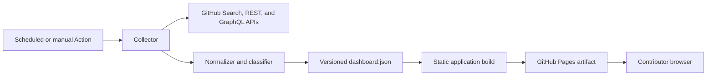

# OpenSourceDeck Product Requirements Document

## Document Control

| Field | Value |
| --- | --- |
| Status | Draft for implementation |
| Product | OpenSourceDeck |
| Owner | `ranxi2001` |
| Last updated | 2026-08-30 |
| Target release | `v0.1.0` |
| Deployment target | GitHub Pages |

## 1. Executive Summary

OpenSourceDeck is a read-only personal operations console for open-source
contributors. It discovers a user's recent public GitHub participation,
groups the work by repository, derives an explainable action state for each
issue and pull request, and presents direct navigation from a single static
site.

The first release is deliberately narrow. A scheduled GitHub Actions workflow
collects public metadata, produces a versioned JSON artifact, builds a static
web application, and deploys it to GitHub Pages. No credential is shipped to
the browser. No upstream issue, pull request, review, notification, or
repository is modified.

## 2. Problem Statement

An active open-source contributor can have work spread across many upstream
repositories. The relevant state is fragmented across:

- authored and assigned issues;
- authored pull requests;
- requested and completed reviews;
- comments and maintainer replies;
- CI checks and merge conflicts;
- repository and fork pages;
- GitHub notifications and saved searches.

The contributor must remember repository names, reconstruct search queries, or
repeatedly navigate through browser history. Existing dashboards generally
optimize for repository owners, notification triage, contribution analytics,
or terminal workflows. They do not consistently turn recent cross-repository
participation into a small set of explainable next-action queues.

## 3. Users And Jobs To Be Done

### 3.1 Primary Persona

An individual contributor who participates in multiple public open-source
projects and wants a daily operational view without maintaining a manual link
directory.

### 3.2 Secondary Persona

A reviewer or maintainer who contributes across several organizations and
needs one place to find pending reviews and work that has become blocked.

### 3.3 Jobs To Be Done

- When I start a work session, show the open items that need my action.
- When I am waiting on upstream, keep those items visible without mixing them
  with actionable work.
- When I remember only the project, let me reach its repository, issues, pull
  requests, and Actions pages without typing a URL.
- When a pull request turns red or receives requested changes, surface the
  transition on the next sync.
- When work is merged or closed, keep a short recent history and then remove it
  from the active workspace.

## 4. Goals

1. Discover recent public GitHub participation without requiring a repository
   allowlist.
2. Reduce time from opening the dashboard to reaching the correct GitHub work
   item.
3. Separate contributor-owned action from upstream-owned waiting.
4. Make every derived state inspectable through source facts and reason codes.
5. Operate as a static GitHub Pages site with no runtime backend.
6. Keep setup fork-friendly and safe for public repositories.

## 5. Non-Goals For v0.1

- Reading or displaying private repositories, issues, pull requests, or
  notifications.
- Mutating GitHub state, including comments, reviews, labels, assignments,
  reruns, merges, or notification read status.
- Replacing GitHub Projects, issue trackers, or repository-native workflows.
- Team workspaces, shared notes, role-based access, or multi-user hosting.
- GitLab, Forgejo, Gitea, or Bitbucket integration.
- AI-generated summaries, priorities, or next actions.
- A database, server-side session, OAuth login, or hosted SaaS control plane.
- General contribution analytics, streaks, rankings, or portfolio pages.

## 6. Product Principles

### 6.1 Read-Only First

Opening or refreshing OpenSourceDeck must never change upstream GitHub state.
All actions leave the site through explicit links to GitHub.

### 6.2 Explainable State

Every queue placement must expose one or more deterministic reason codes, such
as `ci_failure`, `changes_requested`, `review_requested`, or
`last_activity_by_user`. The UI must not present an unexplained priority score.

### 6.3 Activity Discovers Projects

Projects appear because the user recently participated in them. Configuration
may pin, alias, hide, or annotate a discovered project, but it is not the
primary inventory.

### 6.4 Public Means Public

The generated Pages artifact is public data. A secret with private repository
access must not be used by the v0.1 sync job, even if the workflow can store it
safely.

### 6.5 Operational Interface

The dashboard is the first screen. Visual density should support scanning and
repeated action rather than marketing presentation.

## 7. Scope Of v0.1

### 7.1 Automatic Discovery

The sync job discovers public items involving the configured GitHub user within
a configurable lookback window, defaulting to 90 days. Discovery uses separate
queries so the product can preserve the user's role:

- authored issues;
- assigned issues;
- authored pull requests;
- pull requests requesting the user's review;
- pull requests reviewed by the user;
- open issues and pull requests mentioning or otherwise involving the user.

Results are deduplicated by stable GitHub identity and grouped by full
repository name (`owner/name`). The sync job must not use the repository base
name as a unique key.

### 7.2 Enrichment

Open items are enriched only as needed to classify or navigate them:

- repository identity and URL;
- item state, author, assignees, labels, timestamps, and role relationship;
- pull request draft and mergeability state when available;
- review decision and requested reviewers;
- check run summary and links for the current head;
- latest relevant human activity needed to identify the current owner of the
  next action;
- closing or linked item relationships when available without excessive API
  cost.

The collector must preserve partial results when one enrichment request fails.

### 7.3 Project Aggregation

Each discovered repository becomes a project entry containing:

- repository name, owner, avatar, description, and URL;
- counts by action state;
- most recently updated work item;
- direct links to repository Issues, Pull requests, Actions, and the user's
  fork when a public fork is discoverable;
- optional public configuration such as alias, pin, hide, and next-action note.

### 7.4 Work Queues

The primary interface provides these queues:

| Queue | Meaning |
| --- | --- |
| Needs action | A source fact indicates that the configured user should act |
| Waiting upstream | The item is open and the next visible response belongs to another participant |
| Active | The item is open, but ownership of the next action is not established |
| Completed | The item was merged or closed within the retention window |
| Snoozed | A public manual override temporarily removes an item from active queues |

`Unknown` is a data quality state, not a user-facing success state. Unknown
items remain accessible and display the missing facts.

## 8. State Classification Contract

Classification is deterministic and follows this precedence:

1. A valid manual override may set `snoozed`, `active`, or
   `waiting_upstream`. It may not hide source facts such as failing CI.
2. A merged or closed item is `completed`.
3. An open item is `needs_action` when any high-confidence trigger applies:
   - the user's pull request has requested changes;
   - the current pull request head has a failed check;
   - the user is explicitly requested as a reviewer;
   - the user is assigned and the item has a newer external activity;
   - the user is directly mentioned in a newer external activity;
   - the user's pull request has a confirmed merge conflict.
4. An open item is `waiting_upstream` when the latest relevant activity is by
   the configured user and no higher-priority trigger applies.
5. Other open items are `active`.

The output stores both `state` and `reasonCodes`. The UI shows the primary
reason and makes the complete reason list available on demand.

State inference must use bounded language. For example, `waiting_upstream`
means that the last visible relevant activity is by the user; it does not claim
that a maintainer has accepted responsibility or promised a response.

## 9. Functional Requirements

| ID | Requirement | Priority |
| --- | --- | --- |
| FR-001 | Configure one public GitHub username | Must |
| FR-002 | Discover recent public issues and pull requests across repositories | Must |
| FR-003 | Preserve user roles such as author, assignee, reviewer, and mentioned participant | Must |
| FR-004 | Group all work by full repository name | Must |
| FR-005 | Classify work using the state contract in section 8 | Must |
| FR-006 | Display Needs action, Waiting upstream, Active, and Completed views | Must |
| FR-007 | Display exact reason codes and data freshness | Must |
| FR-008 | Link directly to repository, issue, pull request, checks, and Actions pages | Must |
| FR-009 | Search by repository, item number, title, and label | Must |
| FR-010 | Filter by state, item type, role, organization, and freshness | Must |
| FR-011 | Pin, alias, hide, or annotate projects through versioned configuration | Should |
| FR-012 | Snooze an item through versioned public configuration | Should |
| FR-013 | Support keyboard navigation and a command palette | Should |
| FR-014 | Show partial-sync warnings without discarding successful data | Must |
| FR-015 | Refresh on a schedule and through manual workflow dispatch | Must |
| FR-016 | Retain completed items for a configurable period, default 30 days | Should |
| FR-017 | Render well at 360 px mobile width and common desktop widths | Must |

## 10. Information Architecture

### 10.1 Desktop

- Left navigation: project list, project status counts, and pin state.
- Top bar: search, queue selector, sync freshness, and data warning indicator.
- Main region: dense work-item table optimized for scanning.
- Detail drawer or inline expansion: reasons, roles, labels, checks, and quick
  links.

### 10.2 Mobile

- Queue selector remains the first control.
- Project navigation becomes a drawer.
- Work-item rows use a stable compact layout and never require horizontal page
  scrolling.
- Details open below the selected row or in a full-height sheet.

### 10.3 Primary Commands

- Open item on GitHub.
- Open repository.
- Open pull request checks or Actions.
- Copy URL.
- Filter or search.
- Switch queue or project.

All unfamiliar icon-only commands require tooltips and accessible names.

## 11. Configuration Contract

The repository contains a public configuration file, expected to be named
`deck.config.yml`:

```yaml
schema_version: 1
github_user: octocat
lookback_days: 90
completed_retention_days: 30

projects:
  octo-org/example:
    pinned: true
    alias: Example
    next_action: Review maintainer feedback

exclude:
  repositories: []
  labels: []

overrides:
  https://github.com/octo-org/example/pull/42:
    state: snoozed
    until: 2026-09-15
```

All values are public. The documentation must warn users not to store private
notes, customer names, embargoed work, credentials, or security findings in
this file.

Configuration is schema-validated. Unknown fields produce a visible warning;
invalid security-sensitive values fail the sync rather than being ignored.

## 12. Generated Data Contract

The sync job produces `data/dashboard.json` for the build artifact. The schema
contains:

```text
schemaVersion
generatedAt
sourceUser
lookback
projects[]
items[]
syncStatus
rateLimit
warnings[]
```

Each work item contains at least:

```text
id
url
repository
number
type
title
state
reasonCodes[]
roles[]
createdAt
updatedAt
closedAt
labels[]
assignees[]
reviewDecision
checksSummary
links
sourceFacts
```

The schema is versioned independently from the application release. Readers
reject unsupported major schema versions and tolerate additive minor fields.

The generated file contains no token, authorization header, private URL,
email address collected from commit data, comment body, or raw API payload.

## 13. Technical Architecture



### 13.1 Proposed Stack

- TypeScript for collector, schema, classifier, and frontend.
- React with Vite for a static application and predictable Pages base paths.
- A runtime schema library for configuration and generated-data validation.
- Vitest for deterministic classifier and data transformation tests.
- Testing Library for component behavior.
- Playwright for desktop/mobile navigation and rendered-state smoke tests.
- GitHub Actions for scheduled collection, build, test, and Pages deployment.

The implementation may change these libraries through an architecture decision,
but it must preserve the static, read-only, public-data boundary.

### 13.2 Workflow Permissions

The deployment workflow uses least privilege:

- `contents: read` for source checkout and public API access;
- `pages: write` for deployment;
- `id-token: write` for Pages deployment provenance.

The workflow must not commit generated data back to the repository. Build and
deploy jobs pass an artifact. Any future capability requiring broader token
scope needs a separate security review and is out of v0.1.

### 13.3 Refresh Model

- Scheduled refresh defaults to once per hour.
- Manual `workflow_dispatch` is available.
- The UI shows `generatedAt` and considers data stale after two expected
  intervals.
- Schedule delay is expected; the product does not claim real-time state.
- Conditional requests, pagination, query partitioning, and bounded enrichment
  keep API use within the authenticated rate limit.

## 14. Security And Privacy Requirements

| ID | Requirement |
| --- | --- |
| SEC-001 | Never include a GitHub token in client code, static data, logs, or artifacts |
| SEC-002 | Collect and publish public repository data only |
| SEC-003 | Use read-only API operations in v0.1 |
| SEC-004 | Escape or render GitHub-provided text as untrusted content |
| SEC-005 | Do not render raw issue, comment, or PR HTML |
| SEC-006 | Open external links with safe opener isolation |
| SEC-007 | Validate config and generated data against versioned schemas |
| SEC-008 | Keep workflow permissions minimal and explicit |
| SEC-009 | Do not enable analytics or telemetry by default |
| SEC-010 | Do not retain raw API responses in build artifacts |

The public GitHub Events API is not the source of truth for history because its
window and latency are limited. The notification API is excluded because it
requires user authentication and can expose private repository metadata.

## 15. Reliability And Failure Behavior

- A failed discovery query fails the sync and preserves the last successful
  deployed site.
- A failed optional enrichment records a warning and keeps the normalized item.
- Rate limiting records the reset time and fails with a useful diagnostic; the
  collector does not retry indefinitely.
- One malformed API item is quarantined with a warning rather than crashing the
  complete build.
- Generated data is written atomically inside the workflow workspace.
- Empty result sets are valid and render a useful empty workspace.
- The UI never treats missing CI or review data as success.

## 16. Non-Functional Requirements

### 16.1 Performance

- Initial JavaScript budget: 250 KiB gzip or less, excluding fonts.
- Largest Contentful Paint target: under 2.5 seconds on a typical broadband
  connection with 500 work items.
- Search and queue filtering should respond within 100 ms for 1,000 items on a
  mid-range laptop.
- The collector should complete within 10 minutes for 500 discovered items and
  may use bounded parallelism for enrichment.

### 16.2 Accessibility

- Target WCAG 2.2 AA for core flows.
- All interactive controls are keyboard reachable.
- Focus order remains stable when filters change.
- State is never conveyed by color alone.
- Tables, drawers, dialogs, and icon buttons have correct accessible names and
  semantics.

### 16.3 Compatibility

- Current and previous major versions of Chrome, Firefox, Safari, and Edge.
- Responsive behavior at 360, 768, 1280, and 1536 CSS pixels.
- GitHub Pages project-site base paths, not only root-domain deployment.

### 16.4 Maintainability

- Classifier logic is pure and fixture-tested.
- GitHub API access is isolated behind typed adapters.
- UI components do not depend on raw API response shapes.
- Generated schemas and fixtures document compatibility.
- Formatting, lint, unit, build, and smoke commands run in CI.

## 17. Success Metrics

v0.1 is successful when:

1. A user can fork or clone the project, set one GitHub username, enable Pages,
   and receive a useful dashboard without listing repositories.
2. The initial deployment completes within 10 minutes under normal API and
   Actions availability.
3. No credential or private item appears in the built site or Pages artifact.
4. Every displayed queue state has at least one visible reason code.
5. A failing check or requested review appears in Needs action on the next
   successful sync.
6. A merged or closed item leaves active queues and remains in recent history.
7. The principal desktop and mobile workflows pass automated accessibility and
   browser smoke tests.

No product analytics are required for v0.1. Repository adoption, forks, stars,
and issues may be observed through GitHub without adding client telemetry.

## 18. v0.1 Acceptance Criteria

- [ ] Public account activity discovers at least authored issues, authored PRs,
      requested reviews, and completed reviews across repositories.
- [ ] Duplicate search results collapse to one item with all applicable roles.
- [ ] Projects are grouped by `owner/name` and need no manual inventory.
- [ ] State precedence and reason codes match section 8 fixtures.
- [ ] Open PR checks distinguish failure, pending, success, and unavailable.
- [ ] All item and project quick links reach the intended GitHub page.
- [ ] Configuration schema errors are actionable.
- [ ] Partial enrichment failures are visible and do not erase successful data.
- [ ] No secret is present in the bundle, JSON, Pages artifact, or workflow log.
- [ ] The site deploys correctly at `/opensource-deck/`.
- [ ] Desktop and mobile screenshots show no overlap, clipping, or blank primary
      content.
- [ ] Keyboard-only navigation covers queue, project, item, and quick-link flows.
- [ ] The repository documents setup, architecture, security, and contribution
      commands before `v0.1.0`.

## 19. Delivery Plan

### Milestone 0: Bootstrap

- Repository, license, governance, and PRD.
- No product capability claim.

### Milestone 1: Data Foundation

- Configuration and generated-data schemas.
- GitHub API adapters, pagination, and fixtures.
- Discovery, normalization, deduplication, and classifier unit tests.
- Local JSON generation command.

### Milestone 2: Operational Dashboard

- Queue and project navigation.
- Dense work-item view and detail surface.
- Search, filters, reason codes, quick links, and responsive behavior.
- Component, accessibility, and visual smoke tests.

### Milestone 3: Pages Automation

- Scheduled and manual sync workflow.
- Static build and Pages artifact deployment.
- Freshness, partial failure, rate-limit, and empty-state behavior.
- Secret and public-data validation gates.

### Milestone 4: Public Beta

- Fork-and-configure documentation.
- Browser matrix and 500-item performance validation.
- Security review and dependency audit.
- `v0.1.0` release criteria and changelog.

## 20. Risks And Mitigations

| Risk | Impact | Mitigation |
| --- | --- | --- |
| Search indexing delay | Recently updated work appears late | Show freshness and avoid real-time claims |
| Search result cap | Very active accounts lose older items | Partition by time/type and report truncation |
| API schema or permission drift | Sync fails or loses fields | Typed adapters, fixtures, and explicit warnings |
| Ambiguous next-action ownership | Incorrect queue placement | Conservative precedence, reason codes, and Active fallback |
| API cost from enrichment | Rate limiting and slow workflows | Enrich open/actionable items first with bounded concurrency |
| Public config notes leak context | Privacy incident | Prominent warnings, public-only examples, no private mode |
| GitHub Pages schedule delay | Stale dashboard | Timestamp, stale indicator, and manual dispatch |
| User content causes XSS | Credential or session compromise | Treat all remote text as untrusted and never render raw HTML |
| Static-only boundary limits features | No live inbox or mutations | Preserve as a product principle through v0.1; evaluate a GitHub App separately |

## 21. Decisions And Open Questions

### Decisions For v0.1

- Product name: OpenSourceDeck.
- Public, owner-maintained MIT project.
- GitHub Pages deployment.
- Public GitHub data only.
- Read-only behavior.
- Default 90-day discovery and 30-day completed retention.
- Hourly scheduled refresh plus manual dispatch.
- Deterministic classification without AI.

### Open Questions For Implementation

1. Whether GraphQL search or REST search should be the primary discovery API
   after fixture-based cost comparison.
2. How much timeline data is necessary to classify Waiting upstream without
   consuming excessive requests.
3. Whether the first UI should use a table plus detail drawer or a responsive
   master-detail list while preserving the same information architecture.
4. Which configuration overrides remain safe and understandable in a public
   repository.

These questions may change implementation details but must not weaken the
security, public-data, read-only, or explainability requirements.

## 22. Prior Art And Independence

The product should evaluate and credit relevant open-source work, including:

- [PersonalDashboard](https://github.com/roshkhatri/PersonalDashboard) for a
  Pages-based scheduled PR dashboard pattern;
- [gh-dash](https://github.com/dlvhdr/gh-dash) for keyboard-oriented issue and
  pull request workflows;
- [Octobox](https://github.com/octobox/octobox) for notification triage;
- GitHub Issues saved views and GitHub Projects for native filtering and
  planning behavior.

OpenSourceDeck is not a fork in Milestone 0, and no prior-art source code is
included. Any future code reuse must preserve the source license and attribution
and be recorded before it enters the repository.
